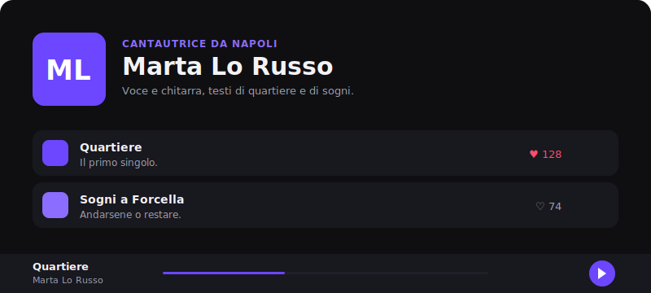

# OpenStage 🎤

**Il tuo sito musicale, online in pochi minuti.**

OpenStage è un template open-source per **un singolo cantautore**: metti i tuoi brani, scrivi le tue info in un file, pubblichi. Niente account da gestire, niente piattaforma di terzi che decide chi ti ascolta. È il **tuo** sito, sul **tuo** dominio.

> Per chi non programma: i passaggi sono "modifica un file di testo, trascina i tuoi MP3, clicca deploy".



---

## 🚀 Mettiti online in 4 passi

1. **Crea la tua copia** — clicca *Use this template* (o fai un fork) su GitHub.
2. **Scrivi le tue info** — apri [`site.config.ts`](site.config.ts) e metti nome, bio e link.
3. **Aggiungi la tua musica** — trascina i file in `public/music/` e le copertine in `public/images/`, poi aggiungi un blocco per ogni brano nell'elenco `tracks`.
4. **Pubblica** — un click qui sotto:

[](https://vercel.com/new/clone?repository-url=https://github.com/iltempe/emerging-artists-weekly)
&nbsp;
[](https://app.netlify.com/start/deploy?repository=https://github.com/iltempe/emerging-artists-weekly)

Vercel e Netlify costruiscono il sito da soli e ti danno un indirizzo `https://…`. In più puoi collegare il **tuo dominio** (es. `www.tuonome.it`) dalle loro impostazioni in due click.

> In alternativa, **GitHub Pages**: gratis e già pronto. Vai su *Settings → Pages → Source: GitHub Actions*. Il workflow incluso pubblica a ogni modifica.

---

## ✏️ Come si configura

Tutto in **un solo file**, [`site.config.ts`](site.config.ts):

```ts
export const site = {
  artist: {
    name: "Marta Lo Russo",
    tagline: "Cantautrice da Napoli",
    bio: "Voce e chitarra, testi di quartiere e di sogni.",
    avatar: "/images/io.jpg",
    accentColor: "#6c47ff",          // il colore del tuo sito
    links: { instagram: "…", spotify: "…", email: "…" },
  },
  tracks: [
    {
      id: "quartiere",                // identificatore univoco
      title: "Quartiere",
      file: "/music/quartiere.mp3",   // file locale… oppure un URL esterno
      cover: "/images/quartiere.jpg",
      description: "Il primo singolo.",
      releaseDate: "2026-05-01",
    },
  ],
};
```

- I **file audio** vanno in `public/music/` (MP3, WAV, OGG). Puoi anche usare un URL esterno.
- Le **copertine/foto** vanno in `public/images/`.
- Il **colore** del sito si cambia con `accentColor`.

## 📊 Contatori ascolti/like (opzionale)

Di default il sito è **100% statico**: nessun backend, nessun contatore. Se vuoi sapere quanti ascolti e like ricevi:

1. Crea un progetto gratuito su [supabase.com](https://supabase.com).
2. Apri *SQL Editor*, incolla [`supabase/schema.sql`](supabase/schema.sql) ed esegui.
3. Copia **Project URL** e **anon key** dal progetto e incollali nel campo `analytics` di `site.config.ts` (oppure come variabili `VITE_SUPABASE_URL` / `VITE_SUPABASE_ANON_KEY`).

I dati sono anonimi: nessun login, nessuna informazione personale di chi ascolta.

## 💻 Sviluppo locale

Serve **Node 18+**.

```bash
npm install
npm run dev      # http://localhost:5173
npm run build    # genera il sito statico in dist/
```

## 🧱 Com'è fatto

React + TypeScript + Vite + Tailwind. Sito statico: gira ovunque, anche su hosting gratuiti.

```
site.config.ts        # ← l'unico file che modifichi
public/music/         # i tuoi file audio
public/images/        # copertine e foto
src/                  # il codice del sito (player, layout, tema)
supabase/schema.sql   # contatori opzionali
```

## 🤝 Contribuire

OpenStage è open source: idee, temi, traduzioni e codice sono benvenuti. Vedi [CONTRIBUTING.md](CONTRIBUTING.md).

## 📄 Licenza

[MIT](LICENSE) — usalo, modificalo, fanne quello che vuoi.
